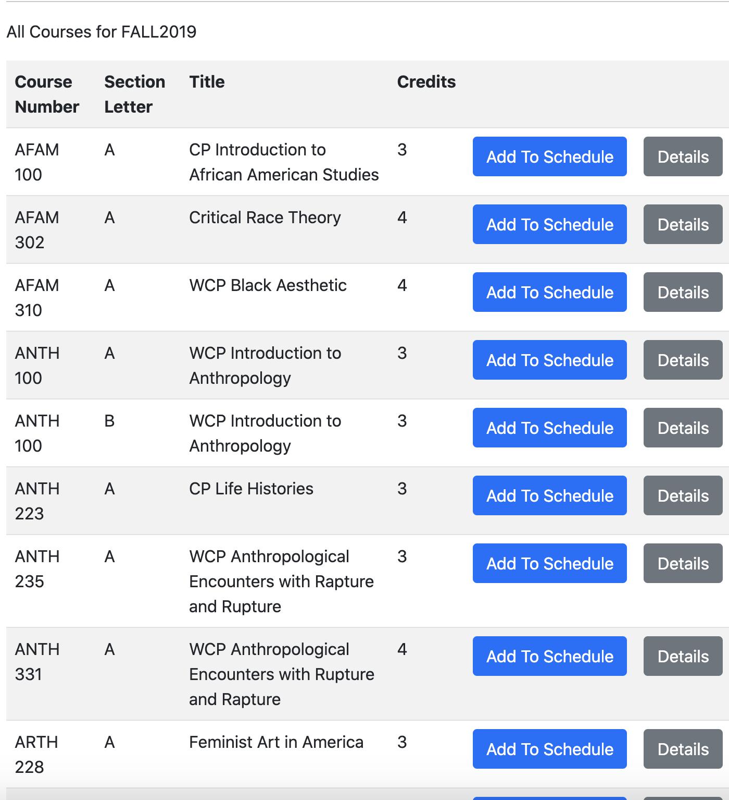
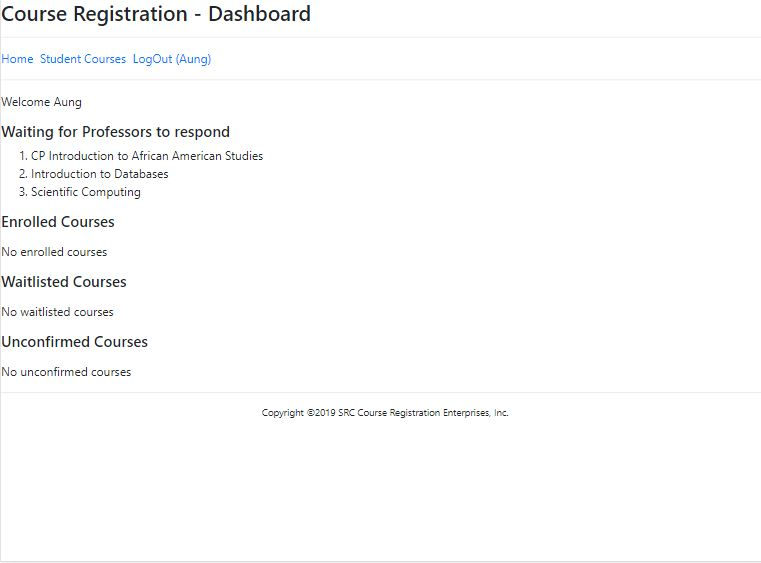
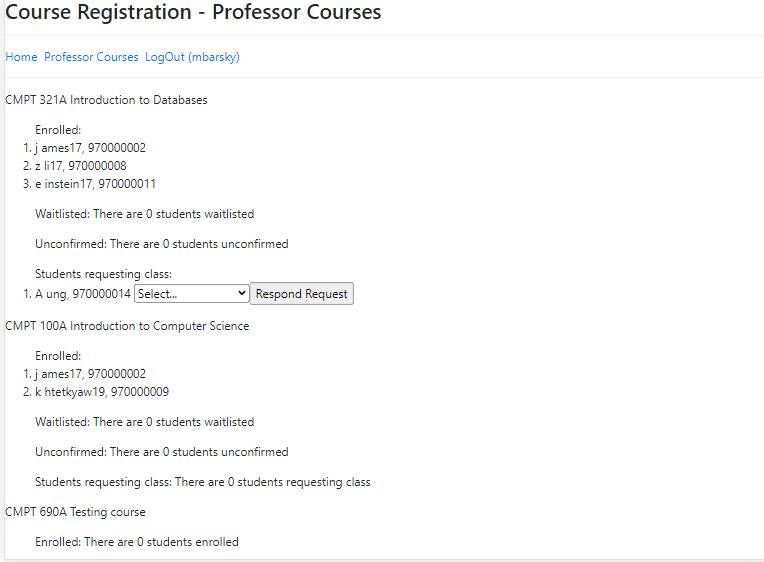
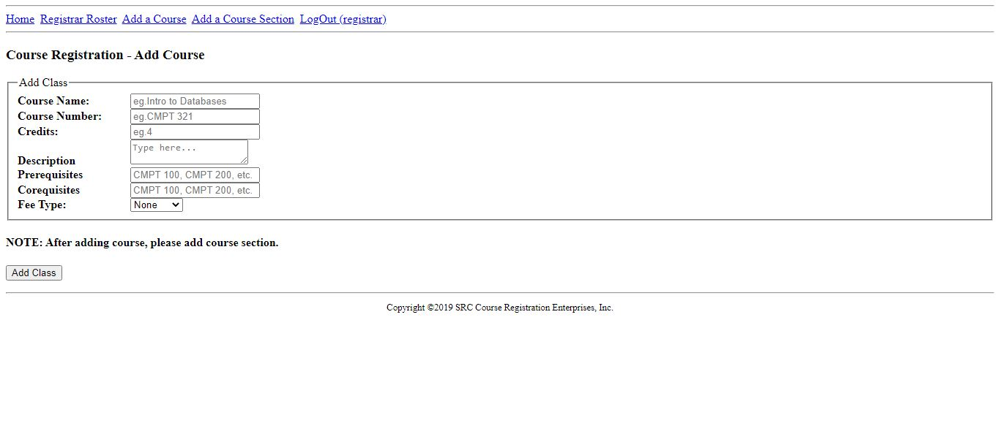
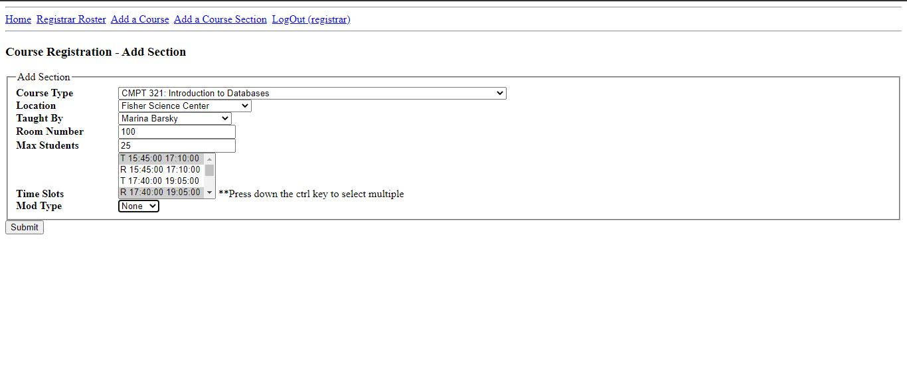

# Course Registration Application

## Summary

   This application helps to streamline the process of course enrollment in Simon's Rock College. The application consists of three main views: student, professors and registrar. Students can select the courses without worries about course conflicting and request enrollment in a course with just a click. Professors can then see lists of courses along with the students who have requested for enrollment. Professors can either accept, put into waitlist or decline. The Registrar can view students' enrollments in all the course and can create courses and sections.

## Some Screenshots

Student's Dashboard
 

Professor's dashboard with the ability to respond the request
 

Adding Course By Registrar
 

Adding Section By Registrar
 

## Why build it?

    Near the end of the semester (especially few days before exams), students wait in line for course registration. This process takes students' time to study. Students are waiting in anxiety because they do not know whether the courses they want to take are full. When their turn come, students have to rush to enroll in courses. If the course they want to take is full, they immediately have to find the course to substitute. Once they have got the signatures from all the professors on the sheet of paper, the students then submit these papers to the appointed staff who will enter those manually into the system.

    Like students, professors have to spend their time waiting for students to register the courses.

    This application is built to solve these problems by moving the registration process online to save time and energy for students, professors and other staffs.

## Functionality

<h3><i>For Students</i></h3>

    Students can choose the courses and the application will filter out all courses that overlap with the courses that they have chosen.

<h3><i>For Professors</i></h3>

    Professors can see the list of courses that they are going to teach along with the information on which students are waiting for approval. Professors can choose to accept, put on waitlist or reject the request.

<h3><i>For Registrar</i></h3>

    Register can see the roster of all the courses along with the status of the students whether the students have already enrolled, waitlisted or rejected. Register can create a course by filling out information provided by the department head. After they have created a course, they create a section. Those changes will be reflected when the students look for courses.

## Tech Stack
<ul>
    <li>HTML</li>
    <li>CSS</li>
    <li>JS</li>
    <li>PHP</li>
    <li>MySQL</li>
</ul>

